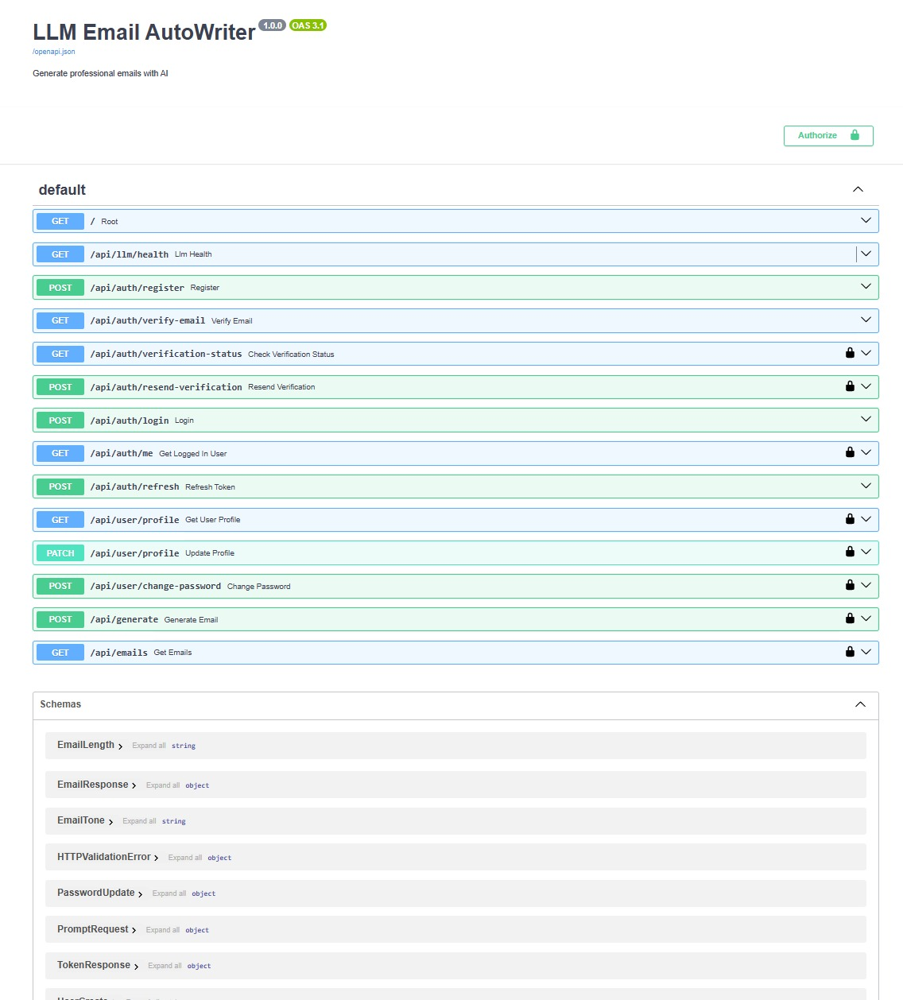
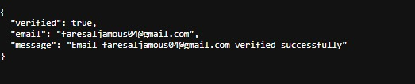
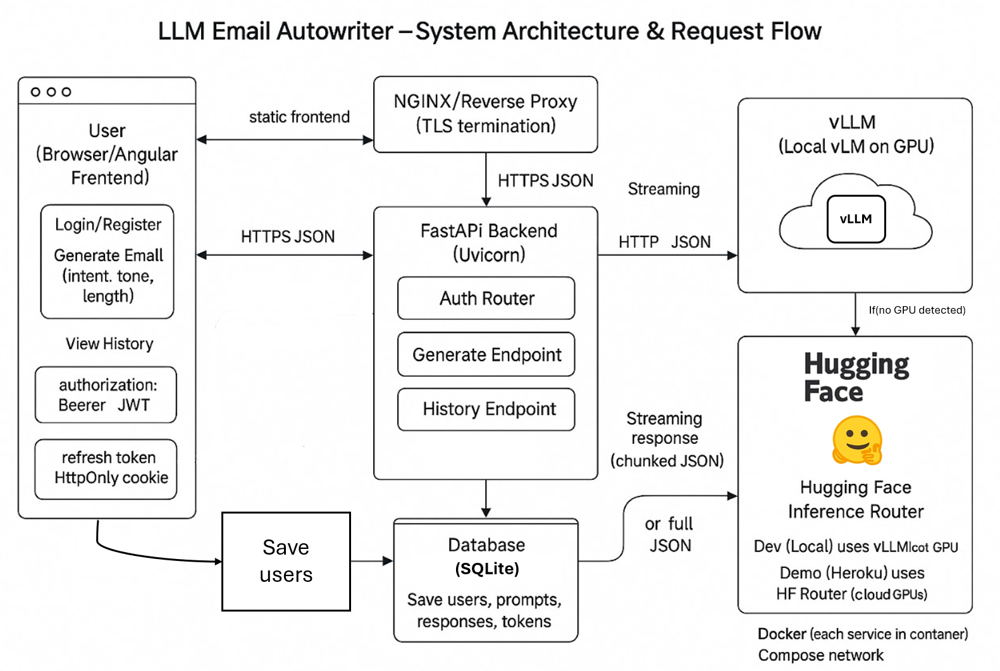
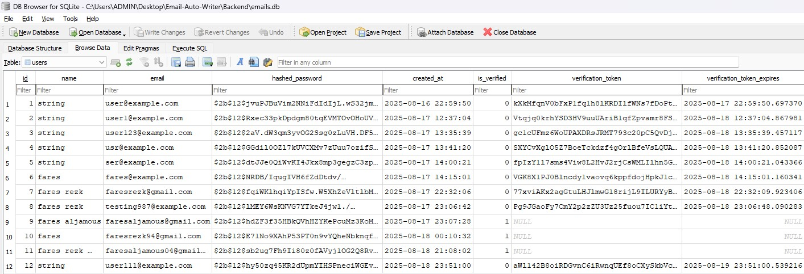
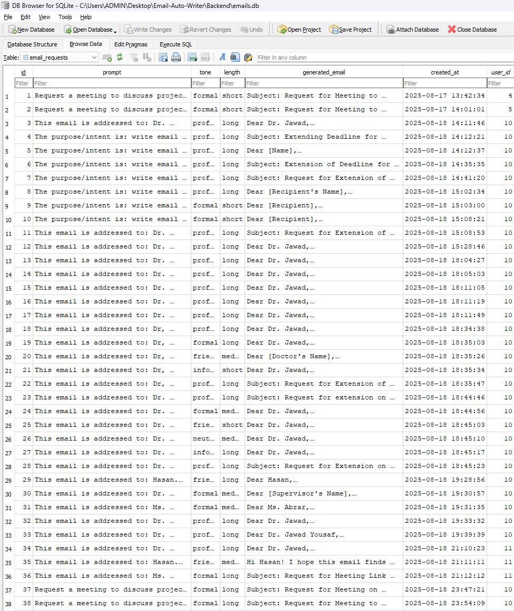

# 🧠 Backend - LLM Email Autowriter

This is the FastAPI backend of the LLM Email Autowriter system. It handles user authentication, email generation, saving history, and communicating with the LLM (vLLM or Hugging Face) for inference.

---

## 🔧 Features

- User Registration & Login (JWT Auth)
- Email Verification Simulation
- Access & Refresh Token System (Secure HttpOnly cookies)
- Email Prompt → LLM → Streamed Response
- SQLite DB with SQLAlchemy ORM
- Swagger Docs for API exploration

---

## 🧪 API Documentation (Swagger)

  
*API endpoints overview*

---

### 📩 Email Verification Logic

  
*Simulated email verification message*

---

## 🔐 Auth Flow

- `POST /api/auth/register`
- `POST /api/auth/login`
- `GET /api/auth/me` *(JWT-protected)*
- `POST /api/auth/refresh` *(via refresh token cookie)*
- `GET /api/auth/verify-email`

---

## 🧱 System Architecture

  
*Architecture & flow overview*

---

## ⚙️ Setup

```bash
cd Backend
python -m venv venv
venv\Scripts\activate  # On Windows
pip install -r requirements.txt
uvicorn main:app --reload
```

Visit: [http://localhost:8000/docs](http://localhost:8000/docs)

---

## 🤖 LLM Inference

You can choose between:

- ✅ **vLLM (local on GPU)**: [http://localhost:8000/generate](http://localhost:8000/generate)
- 🌐 **Hugging Face Router (Heroku demo)**

---

## 🗃️ Database

SQLite is used locally with SQLAlchemy ORM to store:

- 🔐 Users with verification tokens
- 💬 Prompts and generated emails
- 🕓 Timestamps for auditing

### 🧑‍💻 Users Table Preview

  
_User records with email, hashed passwords, verification tokens, and status_

---

### ✉️ Email Requests Table Preview

  
_Stored prompts, tone/length settings, generated email output, timestamps, and user linkage_

---

## 🧪 Development Notes

- `.env.example` included — configure Hugging Face or vLLM endpoints and secrets
- Docker support coming soon (compose-ready)
