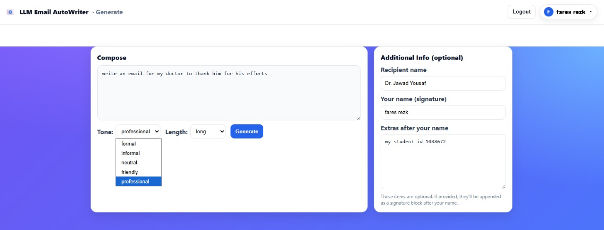
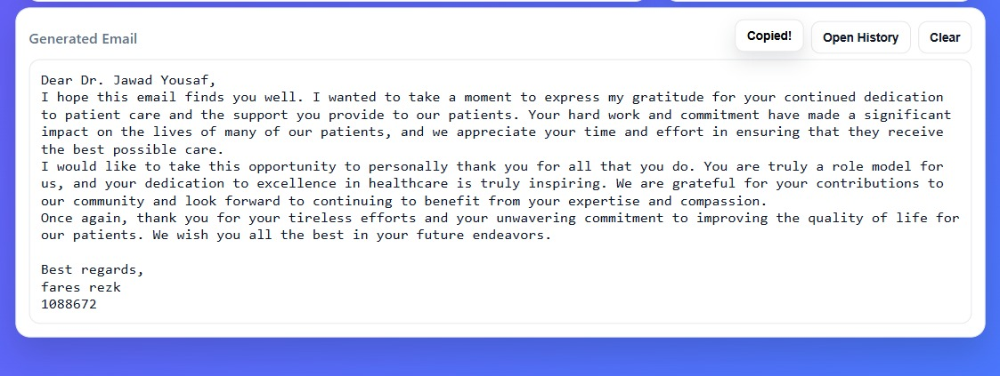

# 🌐 Frontend - LLM Email Autowriter

This is the frontend interface of the LLM Email Autowriter project, built using Angular. It allows users to input prompts, select tone and length, manage authentication, and interact with the LLM-powered backend in real time.


*Landing page with feature highlights*

## 🧠 Features

- Prompt input with tone and length customization
- Signature and recipient input fields
- User registration, login, profile view
- Real-time email generation
- History view with search and filtering
- Responsive and clean UI

## 🖼️ UI Screenshots

### Prompt Input & Generation


- *Generate email with tone & length selection*


- *Tone options dropdown*


- *Length options dropdown*

### Generated Output


- *Email generated from prompt*


- *Buttons to copy or clear the output*

### History and Search


- *Full email generation history*


- *Search by keyword in history*

### Profile and Auth


- *Authenticated profile menu*


- *User profile info (name, email, verification)*


- *Account creation form*


- *User login page*

---

## 🛠️ Setup & Run

```bash
cd Frontend
npm install
ng serve
```

Visit: [http://localhost:4200](http://localhost:4200)

---

## 📁 Tech

- Angular 20.1.6
- TypeScript, HTML, CSS
- Angular Forms, Routing
- JWT Token Storage (HttpOnly Cookie)
