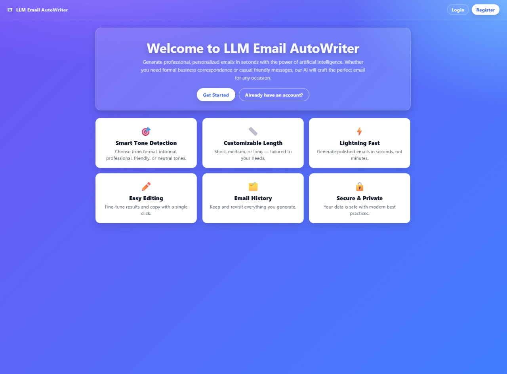
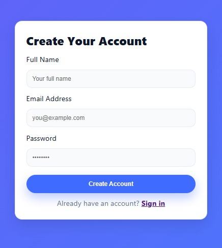
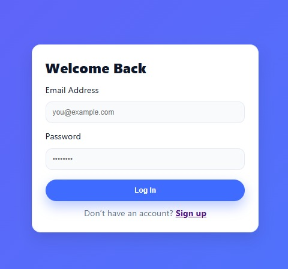
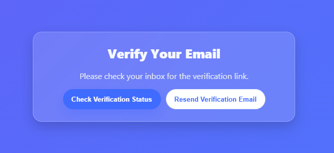
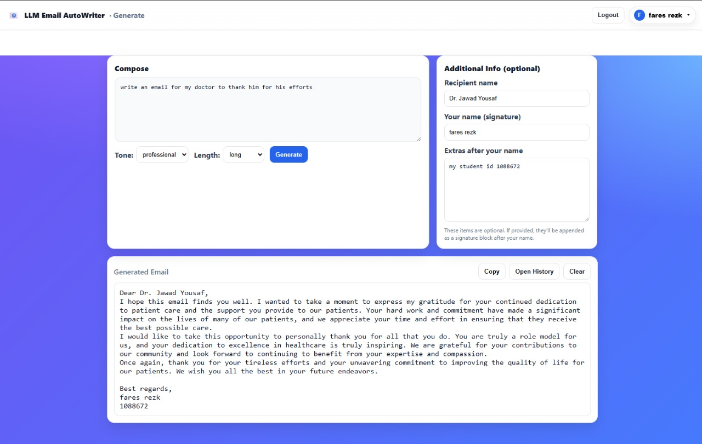
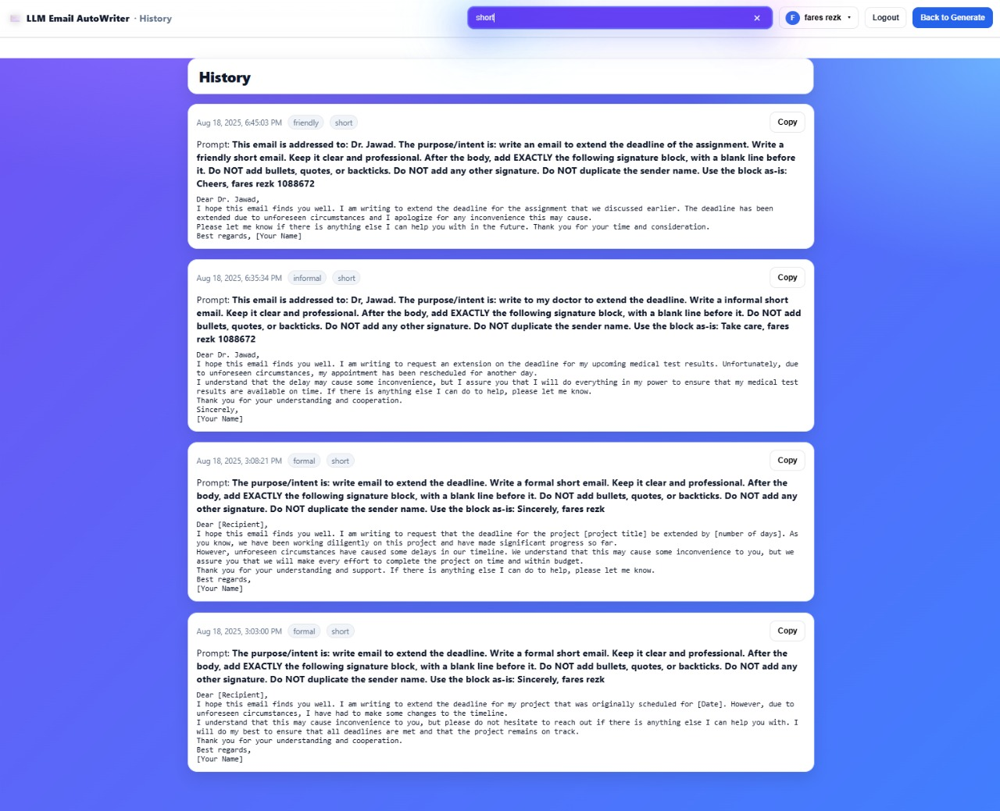
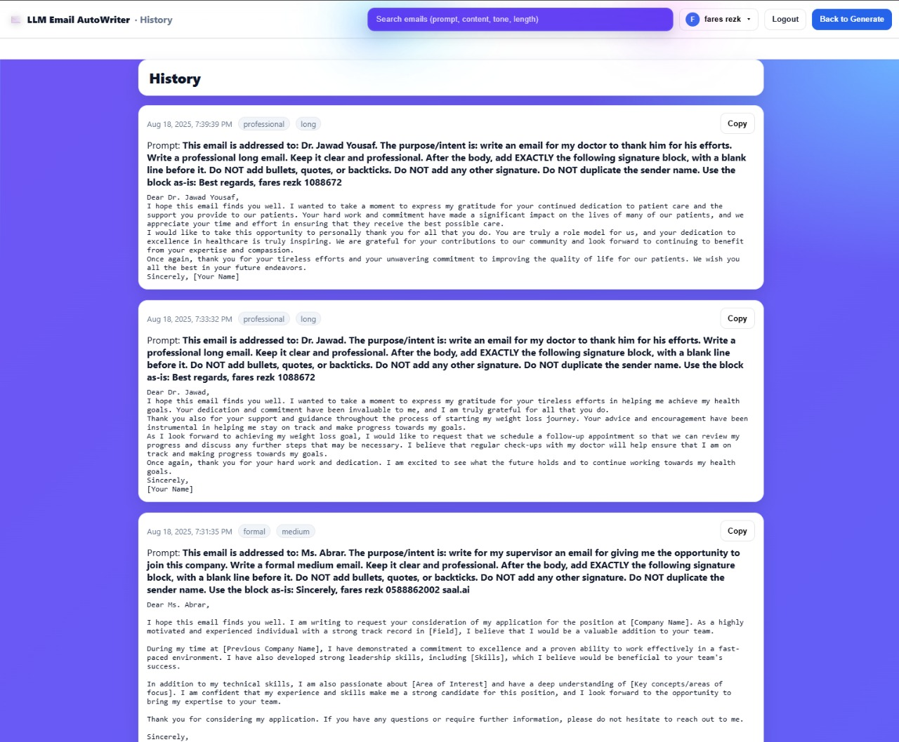
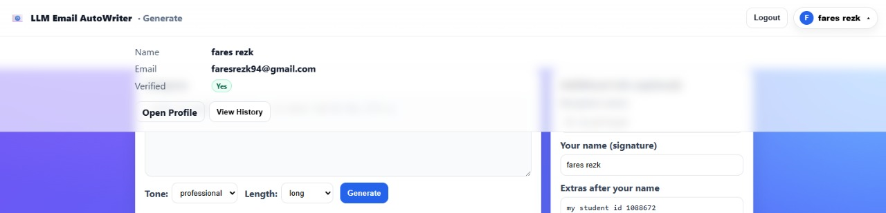
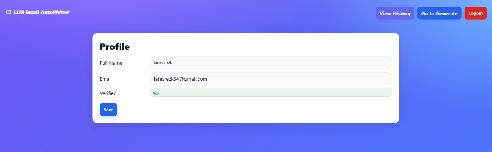

# ✉️ LLM Email Autowriter

LLM Email Autowriter is a full-stack AI-powered web application that helps users generate professional, customized emails from short prompts — fast. Built with a modern stack (Angular + FastAPI + vLLM), the system supports tone and length adjustment, user authentication, and history tracking, all within a sleek and intuitive interface.

---

## 🌐 Live Demo

You can try out the deployed version of this project here:

🔗 **[LLM Email Autowriter on Heroku](https://llm-email-autowriter-demo-e615d6f6162e.herokuapp.com/home)**

> 🧪 You may need to register or log in with a valid email to test all features.  
> ✉️ **Note:** Email verification links may not be sent directly due to Heroku marking them as unsafe.  
> As a workaround, you can skip to `/generate` to test the app manually after registration.  
> ⏳ **Note:** The free-tier Heroku instance may take a few seconds to wake up when inactive.

  
*Homepage showcasing main features and call-to-actions*

---

## 🚀 Features

- 🔥 Generate complete emails with just a short prompt  
- 🎯 Choose tone: formal, informal, neutral, friendly, professional  
- 📏 Adjust length: short, medium, long  
- 📝 Fine-tune signature and extras  
- 💾 Save and view history per user  
- 🔐 Secure user authentication with JWT + refresh tokens  
- 🧠 Powered by Qwen2.5 via vLLM backend for lightning-fast LLM inference  
- 🧪 Swagger for backend testing and development  

---

## 🛠️ Tech Stack

| Layer           | Technology                    |
|----------------|-------------------------------|
| Frontend       | Angular 20.1.6                |
| Backend        | FastAPI                       |
| Authentication | JWT (access + refresh tokens) |
| LLM Inference  | vLLM + Qwen2.5-0.5B            |
| Database       | SQLite via SQLAlchemy ORM      |
| Deployment     | Docker-ready setup             |

---

## 🔐 Authentication System

- Full JWT-based login and registration  
- Token refresh with secure expiration logic  
- Email verification simulation  
- Swagger-protected endpoints  

  
*User registration form*

  
*User login page*

  
*Email verification prompt UI*

  
*Simulated email verification response*

---

## 📋 API Docs – Swagger UI

Accessible via `/docs` route from the FastAPI backend. You can register, login, verify, refresh tokens, and generate emails via Swagger for quick testing.

  
*Interactive API documentation*

---

## 🖼️ User Interface Highlights

### 🧠 Prompt to Email (Generate)

- Choose tone & length  
- Customize recipient and signature  
- View, copy, or clear generated content  

  
*Generate page with tone/length options and custom input*

  
*Generated output shown in real time*

---

### 🧾 History View

- View all previous emails with timestamps, filters, and search  
- See exact prompts used and copy results easily  

  
*Search feature on history page*

  
*Full scrollable email history UI*

---

### 👤 User Profile & Authentication

- View profile info (name, email, verification)  
- Token-protected profile access  

  
*Profile dropdown and access*

  
*Editable user information*

---

## 🏗️ System Architecture & Request Flow

The following diagram shows the architecture of the LLM Email Autowriter system, including frontend, backend, authentication, database, and LLM inference flow (vLLM locally with GPU, or Hugging Face Router as fallback on cloud):

  
*System Architecture & Request Flow*

---

## 🧪 Development Setup

```bash
# Clone the repo
git clone https://github.com/MFaresJA/LLM-Email-Autowriter.git
cd LLM-Email-Autowriter
```
---
🔧 Backend Setup
```bash
cd Backend
python -m venv venv
source venv/bin/activate  # or venv\Scripts\activate on Windows
pip install -r requirements.txt
```
- Create a .env file based on .env.example, then run:
```bash
uvicorn main:app --reload
```
> Access backend Swagger: http://localhost:8000/docs
---
💻 Frontend Setup
```bash
cd Frontend
npm install
ng serve
```
> Access frontend: http://localhost:4200/
---
📦 Docker (Optional for vLLM)
- Backend is Docker-ready to serve Qwen models using vLLM.
- Add your Qwen2.5 model to the backend.
- Use vLLM as the inference engine.
---
✅ Future Work
- Admin dashboard for usage monitoring
= Improved model safety filtering
- Export/download emails
---
## 👤 Author

- Made by **Mohammad Fares Aljamous**
- 🐙 GitHub: [MFaresJA](https://github.com/MFaresJA)
- ✉️ Email: [faresaljamous04@gmail.com](mailto:faresaljamous04@gmail.com)
- 💼 LinkedIn: [mohammad-fares04](https://www.linkedin.com/in/mohammad-fares04?utm_source=share&utm_campaign=share_via&utm_content=profile&utm_medium=ios_app)

