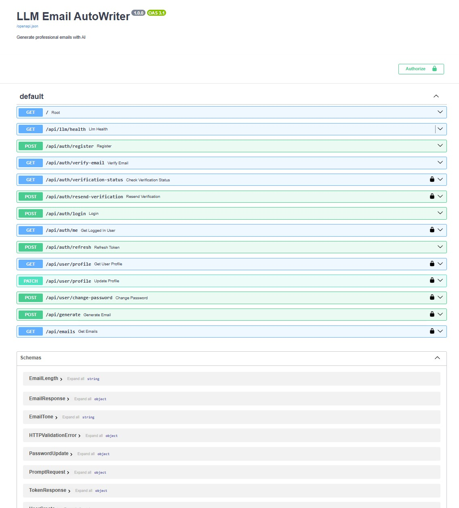
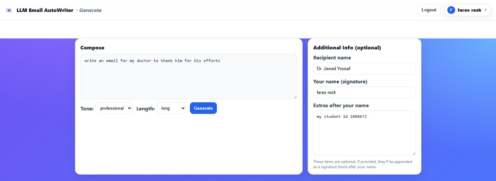

# ✉️ LLM Email Autowriter

LLM Email Autowriter is a full-stack AI-powered web application that helps users generate professional, customized emails from short prompts — fast. Built with a modern stack (Angular + FastAPI + vLLM), the system supports tone and length adjustment, user authentication, and history tracking, all within a sleek and intuitive interface.

  
*Homepage showcasing main features and call-to-actions*

---

## 🚀 Features

- 🔥 Generate complete emails with just a short prompt  
- 🎯 Choose tone: formal, informal, neutral, friendly, professional  
- 📏 Adjust length: short, medium, long  
- 📝 Fine-tune signature and extras  
- 💾 Save and view history per user  
- 🔐 Secure user authentication with JWT + refresh tokens  
- 🧠 Powered by Qwen2.5 via vLLM backend for lightning-fast LLM inference  
- 🧪 Swagger for backend testing and development  

---

## 🛠️ Tech Stack

| Layer           | Technology                    |
|----------------|-------------------------------|
| Frontend       | Angular 20.1.6                |
| Backend        | FastAPI                       |
| Authentication | JWT (access + refresh tokens) |
| LLM Inference  | vLLM + Qwen2.5-0.5B            |
| Database       | SQLite via SQLAlchemy ORM      |
| Deployment     | Docker-ready setup             |

---

## 🔐 Authentication System

- Full JWT-based login and registration  
- Token refresh with secure expiration logic  
- Email verification simulation  
- Swagger-protected endpoints  

  
*User registration form*

  
*User login page*

  
*Simulated email verification response*

---

## 📋 API Docs – Swagger UI

Accessible via `/docs` route from the FastAPI backend. You can register, login, verify, refresh tokens, and generate emails via Swagger for quick testing.

  
*Interactive API documentation*

---

## 🖼️ User Interface Highlights

### 🧠 Prompt to Email (Generate)

- Choose tone & length  
- Customize recipient and signature  
- View, copy, or clear generated content  

  
*Generate page with tone/length options and custom input*

  
*Generated output shown in real time*

---

### 🧾 History View

- View all previous emails with timestamps, filters, and search  
- See exact prompts used and copy results easily  

  
*Search feature on history page*

  
*Full scrollable email history UI*

---

### 👤 User Profile & Authentication

- View profile info (name, email, verification)  
- Token-protected profile access  

  
*Profile dropdown and access*

  
*Editable user information*

---

## 🧪 Development Setup

```bash
# Clone the repo
git clone https://github.com/MFaresJA/LLM-Email-Autowriter.git
cd LLM-Email-Autowriter

🔧 Backend Setup
cd Backend
python -m venv venv
source venv/bin/activate  # or venv\Scripts\activate on Windows
pip install -r requirements.txt

# Create .env file based on .env.example
uvicorn main:app --reload

Visit: http://localhost:8000/docs

💻 Frontend Setup
cd Frontend
npm install
ng serve

Visit: http://localhost:4200/

📦 Docker (Optional for vLLM)

The backend is Docker-ready to run Qwen models using vLLM:
Add your Qwen2.5 model to the backend
Use vLLM as the model server

✅ Future Work

Admin dashboard for usage monitoring
Improved model safety filtering
Export/download emails

👨‍💻 Author
Made by Mohammad Fares Aljamous
GitHub: MFaresJA

Email: faresaljamous04@gmail.com
